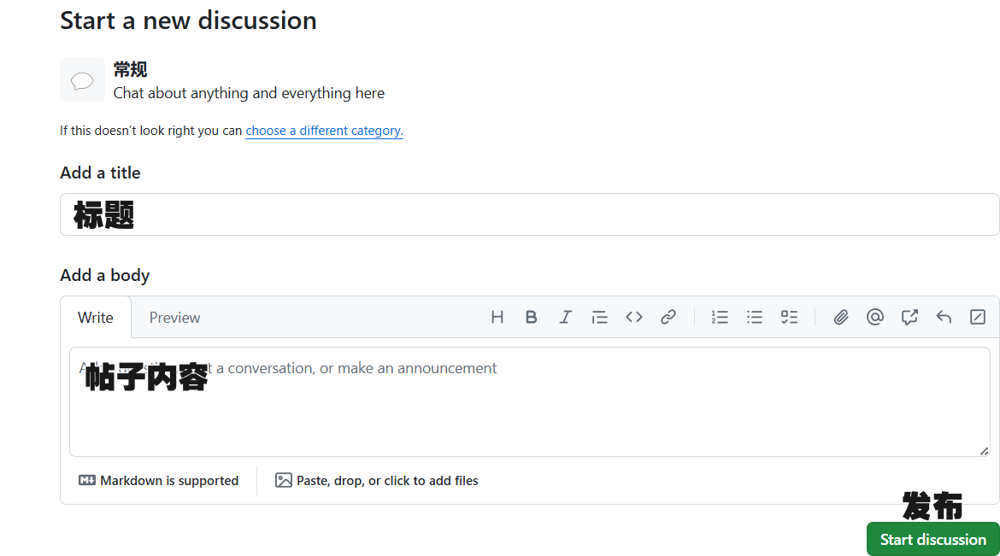

## 公告栏

- **反馈问题请在 [议题](https://github.com/share121/inter-knot/issues)**
- **请遵守 [GitHub 可接受使用政策 - GitHub 文档](https://docs.github.com/zh/site-policy/acceptable-use-policies/github-acceptable-use-policies) 和当地法律法规，违规内容将会被删除**
- _请勿冒充绳网工作人员_

## 使用说明

1. 安装 Tampermonkey（油猴）浏览器扩展，手机端浏览器若支持脚本可以跳过

   > Chrome：[篡改猴 - Chrome 应用商店 (google.com)](https://chromewebstore.google.com/detail/篡改猴/dhdgffkkebhmkfjojejmpbldmpobfkfo)
   >
   > MsEdge：[篡改猴 - Microsoft Edge Addons](https://microsoftedge.microsoft.com/addons/detail/篡改猴/iikmkjmpaadaobahmlepeloendndfphd)
   >
   > Firefox：[Tampermonkey – Get this Extension for 🦊 Firefox (en-US) (mozilla.org)](https://addons.mozilla.org/en-US/firefox/addon/tampermonkey/)

2. 安装**绳网跨域助手** [绳网跨域助手 (greasyfork.org)](https://greasyfork.org/zh-CN/scripts/502874-绳网跨域助手)

3. 访问 [绳网.top](https://绳网.top) 并登录 Github 账号

4. 点击右下角的发布帖子

   下图为界面翻译，如遇网络问题请自行百度 [doge]

## TODO

- [x] 在评论区高亮自己的 ID
- [ ] 发帖后自动刷新
- [ ] 将已经关闭的 Discussions 在瀑布流隐藏
- [ ] 举报功能
- [ ] 一键删除帖子
- [ ] 分享功能
